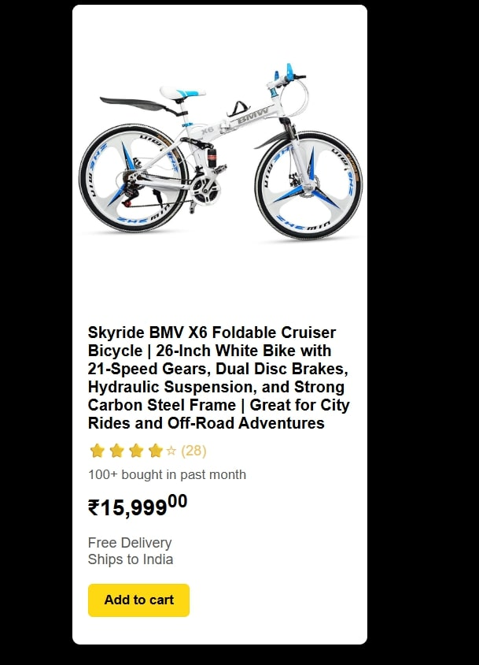

# Clone the Card – HTML & CSS Remix

This is a solution for the "Clone the Card – HTML & CSS Remix" challenge. The goal was to recreate a product card from Amazon using **only HTML and CSS**.

## 🔗 Live Demo
[Click here to view the product card](https://your-live-demo-link.com)  

## 🛠️ Tech Stack
- HTML
- CSS

## 📷 Screenshot

## 📄 Description

I chose to recreate a product card for a **Skyride BMV X6 Foldable Cruiser Bicycle | 26-Inch White Bike with 21-Speed Gears, Dual Disc Brakes, Hydraulic Suspension, and Strong Carbon Steel Frame | Great for City Rides and Off-Road Adventures** from Amazon. The design mimics Amazon's card layout as closely as possible using only HTML and CSS.

### Features:
- Product image
- Title and description
- Star ratings
- Purchase stats
- Price and delivery info
- **"Add to Cart" button** linking directly to the [Amazon product page](https://www.amazon.in/Foldable-21-Speed-Hydraulic-Suspension-Adventures/dp/B0D9Y1VJ12/ref=sr_1_5?crid=3V14BB1NLBUC&dib=eyJ2IjoiMSJ9.mmwGyGuuwyiKEZOYaN5a1ieEX5tdLxAMDNU6RQn8CiWb1Jzsi29jayuI-s_fDTr5YoZemzqMnhJAy_HV89o2fKd4hhh8sHbm1CG90Q5v1I4s1KmBLQgQVkj9FC3c_lNXPdHG9f2Ko1n-ek0pb6aC5vnLSV0kq42rFl9U9FPsj1MnYFMZphM3qfviJUDNy7BOjsM1baoU5Bc2XEQfAlFebn7wE02ROFxuTIvQYl3_e90.cTcpyvOrN3jjkXU_1FpkEQ5AO0zIK56r4xiyVLS0jtI&dib_tag=se&keywords=electric%2Bcycle%2Bfor%2Bmen&qid=1750603074&sprefix=electri%2Caps%2C250&sr=8-5&th=1)

